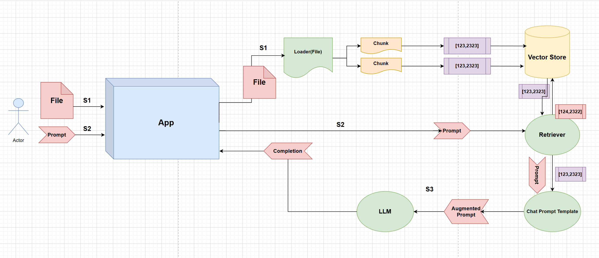

# Semantic Search Engine

## Description

Build a Semantic Search Engine with LangChain, Chroma, Python, Streamlit, and OpenAI. Users will be able to upload a file and ask the model questions about the file.

### Follow the step-by-step tutorial here:

# Cloning

1. To clone the repo run this in your terminal: `git clone https://github.com/AbeTavarez/Semantic-Search-Engine.git`

2. Create a `.env` file and add the OpenAI environment variable and API key: `OPENAI_API_KEY=add-your-key-here`

## Docs

[LangChain API Reference](https://python.langchain.com/api_reference/)

[Chroma](https://www.trychroma.com/)

[Streamlit API Reference](https://docs.streamlit.io/develop/api-reference)